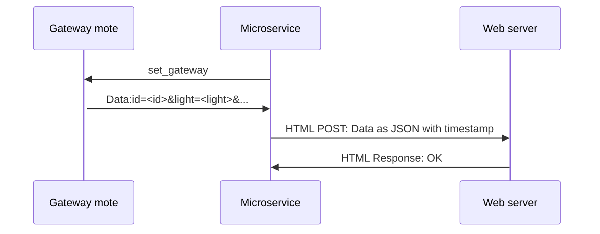

# Manual microservicio

  - [Introducción](#introducción)
  - [Directorios](#directorios)
  - [index.js](#indexjs)

## Introducción

El microservicio es un servicio web que hace de interfaz entre el servidor principal y la mota gateway. Puede controlar los leds de las motas haciendo uso de la api REST y envía las métricas de las motas al servidor principal mediante la REST API del servidor principal.
-	**Microservicio <-> Mota:** Esta comunicación se realiza mediante el uso de la librería *serialport*. Esta librería captura los mensajes que envía la mota gateway y los procesa. Además le envía comandos a la mota gateway mediante UART para los diferentes modos de operación así como para colocar la mota en modo gateway.
-	**Microservicio <-> Servidor web principal:** La comunicación entre estos 2 se realiza mediante una **API REST**. Esto significa que ambos se comunican haciendo uso de los métodos **GET y POST** de *http*. Por ejemplo, el microservicio escucha peticiones POST en la ruta */api/ledlevel*. Esta escucha se realiza usando la librería *express*. Además el servidor principal también escucha en la ruta  */api/latest_record* y el microservicio le realiza peticiones POST mediante el uso de la librería *axios* para enviarle los datos de la última medición.

> El servidor principal es demasiado extenso como para guardarlo en un documento. Es importante ver cómo funciona este, que es un ejemplo más sencillo, antes de lanzarse a mirar el principal.

## Directorios
El proyecto se divide en diferentes archivos y directorios. algunos de los archivos son de configuración y otros de código. Según entramos en el directorio principal vemos lo siguiente:
````bash
C:.
│   .eslintrc.js
│   .gitignore
│   index.js
│   package-lock.json
│   package.json
│   README.md
│
└───lib
    └───config
            .credentials.development.json
            .credentials.production.json
            .gitignore
            config.js
````
Poco a poco veremos los archivos.

 - **.eslintrc.js :**  Este es un archivo de configuración para el módulo ESLINT. ESLINT es un software que te ayuda a seguir unas reglas determinadas al programar en javascript.
 - **.gitignore :** El archivo gitignore nos permite ignorar una serie de archivos a la hora de subir a github los proyectos.
 - **index.js :** El archivo principal del microservicio. Aquí se ejecuta todo el servidor web y la interfaz de comunicación con las motas.
 - **package.json y package-lock.json :** Archivos internos de node en los que se especifica las librerías que se usan y sus versiones así como metadatos y comandos de ejecución. Por ejemplo se define el comando **start** que es el encargado de iniciar el servidor.

> El comando se usa como: ***npm run start***
-	**Readme.md :** este archivo.
-	./lib/config/**config.js :** es un módulo sencillo que carga los archivos de  credenciales para utilizarlos. Los archivos de credenciales se cargan así y no se incluyen en el github porque tienen datos sensibles.
-	./lib/config/**.credentials.development.json** || **.credentials.production.json :** estos dos archivos son los que contienen la información privada como contraseñas keys y demás que no deben estar subidas a un repositorio. Un ejemplo de archivo es el siguiente:
````json
{
	"port": 1234,
	"api": {
		"url": "https://example.ex:port/api/latest_record",
		"keys": [
			"EXAMPLE_KEY"
		]
	},
	"mote":{
		"route":"/dev/ttyUSB0",
		"baudRate": 115200
	}
}
````

## index.js

El archivo principal se compone de varias partes.
 ```` javascript
 const {credentials} =  require('./lib/config/config');
const  express  =  require('express');
const  bodyParser  =  require('body-parser');
const  morgan  =  require('morgan');
const  fs  =  require('fs');
const  SerialPort  =  require('serialport');
const { exit } =  require('process');
const  axios  =  require('axios');

const  app  =  express();
````
 1. **Imports:** Aquí importamos las diferentes librerías que utilizamos. aquí dejo una lista de las páginas de npm de todos ellos en caso de necesitarlo.
	 - [express](https://www.npmjs.com/package/express)
	 - [body-parser](https://www.npmjs.com/package/body-parser)
	 - [morgan](https://www.npmjs.com/package/morgan)
	 - [fs](https://nodejs.org/api/fs.html)
	 - [serialport](https://www.npmjs.com/package/serialport)
	 - [axios](https://www.npmjs.com/package/axios)
```javascript
//---------------------------------------------------
// 			Middleware
//---------------------------------------------------
switch(app.get('env')){
case 'development':
	app.use(morgan('dev'));
	break;
/* eslint-disable no-case-declarations */
case 'production':
	const  stream  =  fs.createWriteStream(__dirname  +  '/access.log', {flags: 'a'});
	app.use(morgan('combined', {stream}));
	break;
/* eslint-enable no-case-declarations */
}

app.use(bodyParser.json());
```
2. **Middleware:** el middleware son todas las funciones por las que pasan las peticiones hasta llegar al endpoint

> Por ejemplo, al ir al endpoint ***/api/ledlevel*** nuestra petición pasará por *morgan* que logeará nuestra petición. Después pasará por *body-parser* que convertirá nuestro cuerpo de la petición ***POST*** en un objeto que node entienda. Este objeto es el ***req.body***.
```javascript
//---------------------------------------------------
// 			Routes
//---------------------------------------------------
app.get('/', (req, res) => {
	res.json({msg:'Alive'});
});

app.post('/api/ledlevel', (req, res) => {
	console.log('Body received: ' + JSON.stringify(req.body));
	if(credentials.api.keys.includes(req.body.key)) {
		const mote = req.body.mote;
		console.log(mote);
		if(typeof(mote.mode) === 'number') {
			switch (mote.mode) {
			case  0:
				serialCom.write(`manual_${mote.id}\n`);
				res.json({msg: 'OK set to manual'});
				return;
			case  1:
				serialCom.write(`automatico_${mote.id}\n`);
				res.json({msg: 'OK set to auto'});
				return;
			}
		}else  if(typeof(mote.ledLevel) ===  'number'){
			serialCom.write(`led_${mote.ledLevel}_${mote.id}\n`);
			res.json({msg: `OK sent: led_${mote.ledLevel}_${mote.id}\n`});
			return;
		}else{
			res.status(404).json({msg:'ERROR: no ledlevel or mode specified'});
			return;
		}
		res.json({msg: 'OK'});
		return;
	} else {
		res.status(401).json({
			msg: 'ERROR invalid credentials'
		});
		return;
	}
});

app.use((req, res) => {
	res.status(404).json({msg: 'Not Found'});
});

app.use((req, res) => {
	res.status(500).json({msg: 'Internal server error'});
});
```
3. **Rutas:** Aquí definimos 4 rutas. 2 rutas de uso para los usuarios y 2 del servidor para cuando se producen errores.
	-	***"/":*** Ruta simple que devuelve el mensaje alive, como si fuera un ping versión HTML para saber si el microservicio está funcionando o no.
	-	***"/api/ledlevel":*** Esta es la ruta que acepta los POST. Se le puede enviar el modo o el nivel del LED a la mota que se quiera. Procesa el cuerpo de la petición y decide que comando enviar a la mota gateway usando el objeto serialCom.
	-	***404:*** Cuando no se conoce la ruta se envía una respuesta en JSON con el mensaje *"Not Found"*.
	-	***500:*** En caso de existir un error en el servidor interno, se llega a esta ruta y devuelve el mensaje en JSON *"Internal server error"*.
```javascript
//---------------------------------------------------
// 		Start server and serialcom
//---------------------------------------------------
var serialCom;
function  StartServerInstance(port, serialRoute, serialBaud) {
	app.listen(port, () => {
		console.log(`Express server in ${app.get('env')} mode, started on http://localhost:${port};
		Press Ctrl-C to terminate.`);
	});
	
	process.on('uncaughtException', (err) => {
		console.log(`FATAL ERROR: UNCAUGHT EXCEPTION
		ERRORMSG: ${err.message}
		stacktrace: ${err.stack}`);
	});

	serialCom = new SerialPort(serialRoute, {baudRate:serialBaud}, (err) => {
		if(err){
			console.log('ERROR on serial: '  +  err);
			exit(1);
		}
	});

//TODO: leer los mensajes desde el ; hasta el ; o reiniciar el buffer cada vez que tenemos un match del regex
	serialCom.on('data', (dataBuffer) => {
		let dataString = (dataBuffer.toString('ascii')).trim();
		console.log('DataString: ' + dataString);
		let re = /DATA:id=(\d+)&light=(\d+)&temp=(\d+)&led=(\d+)/gm;
		let matches = re.exec(dataString);
		//console.log(matches);
		if(matches){
			const moteId = matches[1];
			const light = matches[2];
			const temp = matches[3];
			const ledLevel = matches[4]; 
			 
			const record = {
				mote: moteId,
				timestamp: new Date(Date.now()),
				light: light,
				temperature: temp,
				ledLevel: ledLevel,
			};

			const body = {
				key: credentials.api.keys[0],
				record: record,
			};

			axios({
				method: 'post',
				url: credentials.api.url,
				data:body,
			}).then((resp) => {
				console.log(resp.data);
			}).catch((err) => {
				console.log(err);
			});
		}
	});  
	
	serialCom.write('set_gateway\n');
	setInterval(() => {serialCom.write('set_gateway\n');}, 30*1000);
}

if(require.main === module){
	StartServerInstance(credentials.port, credentials.mote.route, credentials.mote.baudRate);
} else {
	module.exports = StartServerInstance;
}
```
4.	**serialCom y StartServer:** Aquí se define la función StartServerInstance que inicia  la aplicación y configura las diferentes partes del servicio. Define una rutina en caso de que se produzca una excepción no controlada. Además abre una instancia de serialport llamada serialCom. Se configura serialcom para recibir los mensajes de datos de la mota por el puerto serie mediante una expresión regular y una vez captados los datos se convierten a JSON y se envían al servidor principal. Finalmente se envía por serial el comando *set_gateway* y se crea una rutina que envía cada 30 segundos el comando *set_gateway* en caso de que alguna mota se reinicie.